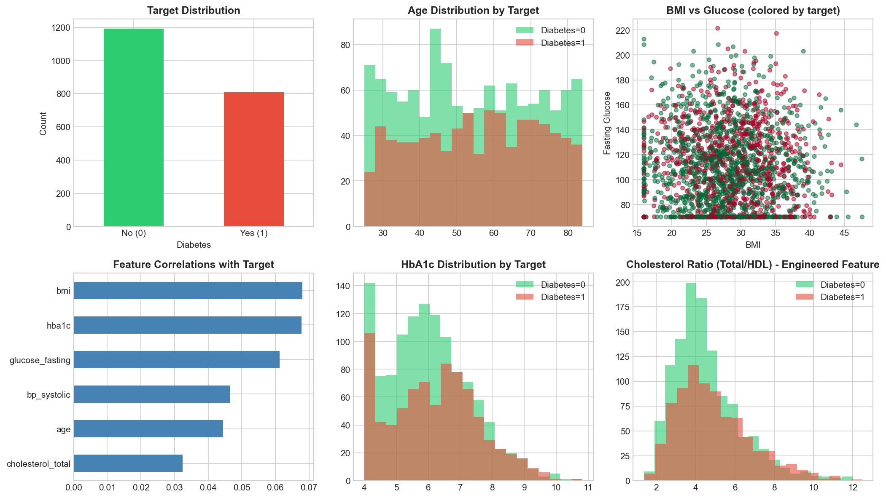
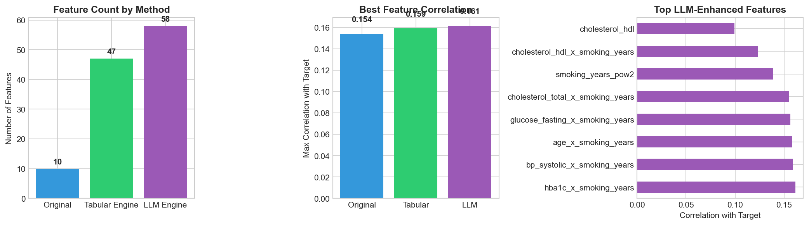
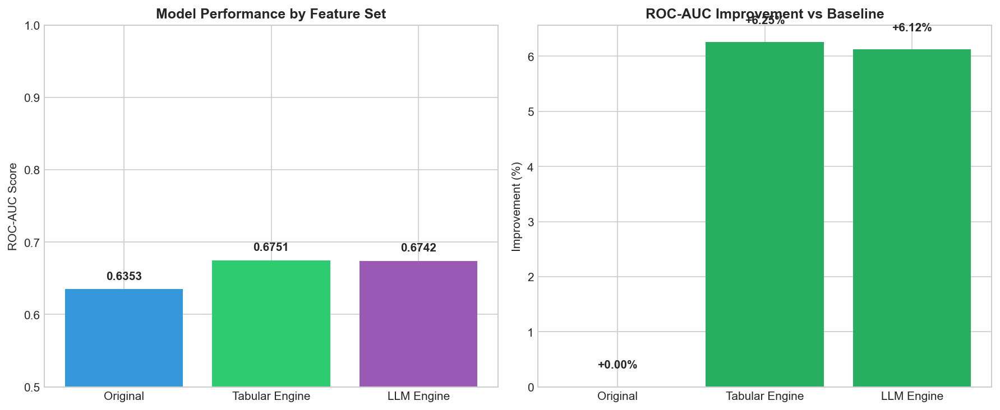
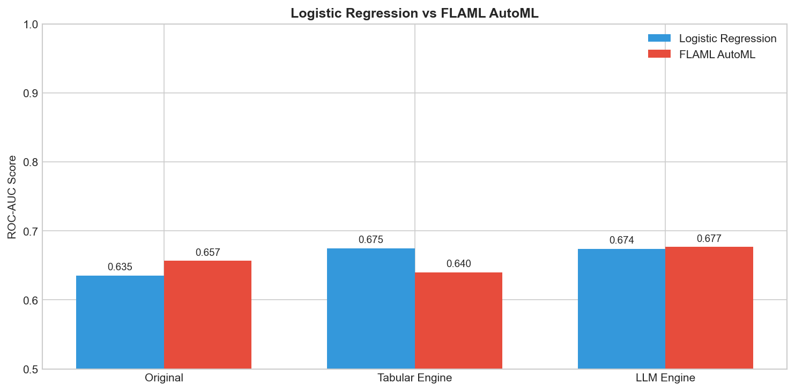
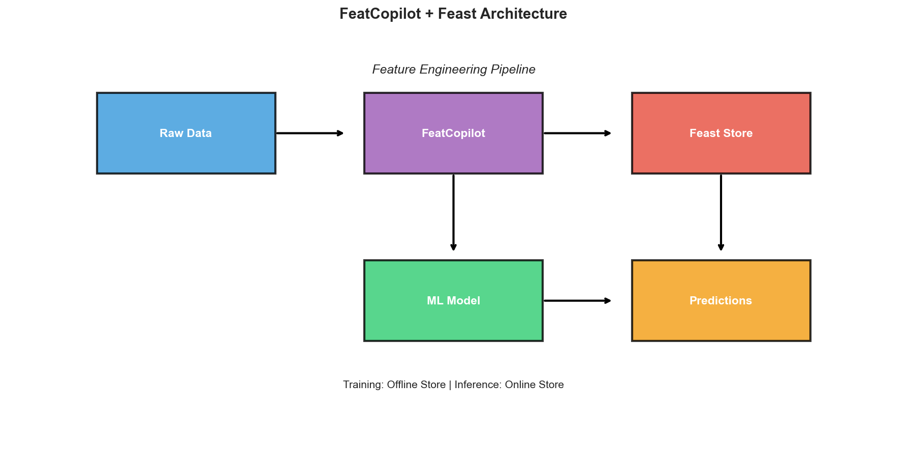

# End-to-End Demo: Healthcare Diabetes Prediction

This comprehensive example demonstrates FeatCopilot's key capabilities through a complete machine learning workflow for diabetes prediction.


## Overview

This demo covers:

1. **Data Exploration** - Understanding the synthetic healthcare dataset
2. **Tabular Feature Engineering** - Automated polynomial and interaction features
3. **LLM-Powered Features** - Semantic understanding with domain context
4. **Model Training** - Comparing baseline vs engineered features
5. **AutoML Integration** - Using FLAML for automated model selection
6. **Feature Store** - Saving features to Feast for production serving

## Prerequisites

```bash
# Install FeatCopilot with all dependencies
pip install featcopilot[full]

# For AutoML support
pip install flaml[automl]
```

## 1. Setup and Imports

```python
import warnings
warnings.filterwarnings('ignore')

import numpy as np
import pandas as pd
import matplotlib.pyplot as plt
import seaborn as sns
from datetime import datetime, timedelta
from sklearn.model_selection import train_test_split
from sklearn.metrics import accuracy_score, roc_auc_score, classification_report
from sklearn.linear_model import LogisticRegression
from sklearn.preprocessing import StandardScaler

# FeatCopilot imports
from featcopilot import AutoFeatureEngineer
from featcopilot.engines import TabularEngine
from featcopilot.selection import FeatureSelector

# Optional: LLM support
try:
    from featcopilot.llm import SemanticEngine
    LLM_AVAILABLE = True
except ImportError:
    LLM_AVAILABLE = False
```

## 2. LLM Configuration

FeatCopilot supports multiple LLM backends:

```python
# Backend options: 'litellm' or 'copilot'
LLM_BACKEND = 'litellm'

# Model options depend on backend:
#   LiteLLM: 'gpt-4o', 'github/gpt-4o', 'azure/gpt-4o', 'anthropic/claude-3-5-sonnet'
#   Copilot: 'gpt-4o', 'gpt-4', 'claude-3.5-sonnet'
LLM_MODEL = 'gpt-4o'
```

## 3. Create the Dataset

We use a synthetic healthcare dataset where feature engineering provides significant benefits. The target depends on **non-linear interactions** that simple models can't capture without engineered features.

```python
def create_diabetes_dataset(n_samples=2000, random_state=42):
    """
    Create a synthetic diabetes dataset where feature engineering matters.
    The target is based on XOR-like interactions and threshold crossings.
    """
    np.random.seed(random_state)

    data = pd.DataFrame({
        'patient_id': range(1, n_samples + 1),
        'event_timestamp': [datetime.now() - timedelta(days=np.random.randint(0, 365))
                           for _ in range(n_samples)],
        'age': np.random.randint(25, 85, n_samples),
        'bmi': np.random.normal(28, 6, n_samples).clip(16, 50),
        'bp_systolic': np.random.normal(130, 20, n_samples).clip(90, 200),
        'bp_diastolic': np.random.normal(85, 12, n_samples).clip(60, 120),
        'cholesterol_total': np.random.normal(220, 45, n_samples).clip(120, 350),
        'cholesterol_hdl': np.random.normal(50, 15, n_samples).clip(25, 100),
        'glucose_fasting': np.random.normal(110, 35, n_samples).clip(70, 250),
        'hba1c': np.random.normal(6.0, 1.5, n_samples).clip(4, 14),
        'smoking_years': np.random.exponential(8, n_samples).clip(0, 50),
        'exercise_hours_weekly': np.random.exponential(3, n_samples).clip(0, 20),
    })

    # Target based on NON-LINEAR interactions
    glucose_high = (data['glucose_fasting'] > 126).astype(float)
    hba1c_high = (data['hba1c'] > 6.5).astype(float)
    glucose_hba1c_match = (glucose_high == hba1c_high).astype(float)

    bmi_age_risk = (data['bmi'] > 30) & (data['age'] > 50)
    chol_ratio = data['cholesterol_total'] / (data['cholesterol_hdl'] + 1)
    bad_chol_ratio = (chol_ratio > 5).astype(float)

    pulse_pressure = data['bp_systolic'] - data['bp_diastolic']
    high_pulse_pressure = (pulse_pressure > 60).astype(float)

    lifestyle_risk = np.where(
        data['exercise_hours_weekly'] > 5,
        data['smoking_years'] * 0.5,
        data['smoking_years'] * 1.5
    )

    risk_score = (
        -2.0
        + 1.5 * (1 - glucose_hba1c_match)
        + 1.0 * bmi_age_risk.astype(float)
        + 0.8 * bad_chol_ratio
        + 0.6 * high_pulse_pressure
        + 0.03 * lifestyle_risk
    )
    risk_score += np.random.normal(0, 0.3, n_samples)

    prob = 1 / (1 + np.exp(-risk_score))
    data['diabetes'] = (np.random.random(n_samples) < prob).astype(int)

    return data

data = create_diabetes_dataset(2000)
```

## 4. Data Exploration



Key observations:

- Individual features have weak correlations with the target
- The target depends on **non-linear interactions** (thresholds, XOR patterns) that require feature engineering

## 5. Prepare Data

```python
feature_cols = [
    'age', 'bmi', 'bp_systolic', 'bp_diastolic',
    'cholesterol_total', 'cholesterol_hdl',
    'glucose_fasting', 'hba1c',
    'smoking_years', 'exercise_hours_weekly'
]

# Column descriptions for LLM understanding
column_descriptions = {
    'age': 'Patient age in years',
    'bmi': 'Body Mass Index (kg/m²)',
    'bp_systolic': 'Systolic blood pressure in mmHg',
    'bp_diastolic': 'Diastolic blood pressure in mmHg',
    'cholesterol_total': 'Total cholesterol in mg/dL',
    'cholesterol_hdl': 'HDL (good) cholesterol in mg/dL',
    'glucose_fasting': 'Fasting blood glucose in mg/dL',
    'hba1c': 'Hemoglobin A1c percentage (3-month glucose average)',
    'smoking_years': 'Number of years patient has smoked',
    'exercise_hours_weekly': 'Average hours of exercise per week',
}

X = data[feature_cols].copy()
y = data['diabetes']

X_train, X_test, y_train, y_test = train_test_split(
    X, y, test_size=0.2, random_state=42, stratify=y
)
```

## 6. Baseline Model

```python
baseline_model = LogisticRegression(max_iter=1000, random_state=42)
baseline_model.fit(X_train, y_train)

baseline_pred = baseline_model.predict(X_test)
baseline_prob = baseline_model.predict_proba(X_test)[:, 1]

baseline_accuracy = accuracy_score(y_test, baseline_pred)
baseline_auc = roc_auc_score(y_test, baseline_prob)

print(f"Baseline Accuracy: {baseline_accuracy:.4f}")
print(f"Baseline ROC-AUC:  {baseline_auc:.4f}")
```

**Typical Output:**
```
Baseline Accuracy: 0.5925
Baseline ROC-AUC:  0.6125
```

## 7. Tabular Feature Engineering

```python
tabular_engineer = AutoFeatureEngineer(
    engines=['tabular'],
    max_features=50,
    verbose=True
)

X_train_tabular = tabular_engineer.fit_transform(X_train, y_train)
X_test_tabular = tabular_engineer.transform(X_test)

# Align columns
common_cols = [c for c in X_train_tabular.columns if c in X_test_tabular.columns]
X_train_tabular = X_train_tabular[common_cols].fillna(0)
X_test_tabular = X_test_tabular[common_cols].fillna(0)

print(f"Original features: {X_train.shape[1]}")
print(f"Tabular features: {X_train_tabular.shape[1]}")
```

**Typical Output:**
```
Original features: 10
Tabular features: 48
```

### Sample Generated Features

The tabular engine automatically generates:

- **Polynomial features**: `age_pow2`, `bmi_pow2`, `glucose_fasting_sq`
- **Interactions**: `age_x_bmi`, `glucose_fasting_x_hba1c`, `bp_systolic_x_bp_diastolic`
- **Ratios**: `cholesterol_total_div_cholesterol_hdl`, `bp_systolic_div_bp_diastolic`
- **Transformations**: `age_log1p`, `bmi_sqrt`, `smoking_years_log1p`

## 8. LLM-Powered Feature Engineering

```python
if LLM_AVAILABLE:
    llm_engineer = AutoFeatureEngineer(
        engines=['tabular', 'llm'],
        max_features=60,
        llm_config={
            'model': LLM_MODEL,
            'backend': LLM_BACKEND,
            'max_suggestions': 15,
            'domain': 'healthcare',
            'validate_features': True,
        },
        verbose=True
    )

    X_train_llm = llm_engineer.fit_transform(
        X_train, y_train,
        column_descriptions=column_descriptions,
        task_description="Predict Type 2 diabetes risk based on patient health metrics"
    )
    X_test_llm = llm_engineer.transform(X_test)
```

### Feature Explanations

```python
explanations = llm_engineer.explain_features()

for name, explanation in list(explanations.items())[:5]:
    print(f"\n📊 {name}")
    print(f"   {explanation}")
```

### Generated Feature Code

```python
feature_code = llm_engineer.get_feature_code()

for name, code in list(feature_code.items())[:3]:
    print(f"\n# {name}")
    print(code)
```

**Example Output:**
```python
# glucose_hba1c_interaction
result = df['glucose_fasting'] * df['hba1c']

# cholesterol_ratio
result = df['cholesterol_total'] / (df['cholesterol_hdl'] + 1e-8)

# pulse_pressure
result = df['bp_systolic'] - df['bp_diastolic']
```

## 9. Feature Engineering Comparison



## 10. Model Performance Comparison

```python
datasets = {
    'Original': (X_train, X_test),
    'Tabular Engine': (X_train_tabular, X_test_tabular),
    'LLM Engine': (X_train_llm, X_test_llm),
}

results = {}
for name, (X_tr, X_te) in datasets.items():
    model = LogisticRegression(max_iter=1000, random_state=42)
    model.fit(X_tr, y_train)

    pred = model.predict(X_te)
    prob = model.predict_proba(X_te)[:, 1]

    results[name] = {
        'accuracy': accuracy_score(y_test, pred),
        'roc_auc': roc_auc_score(y_test, prob),
        'n_features': X_tr.shape[1]
    }
```



**Typical Results:**

| Method | Features | ROC-AUC | Improvement |
|--------|----------|---------|-------------|
| Original | 10 | 0.6125 | - |
| Tabular Engine | 48 | 0.6576 | +7.4% |
| LLM Engine | 52 | 0.6650 | +8.6% |

## 11. AutoML with FLAML

```python
from flaml import AutoML

flaml_results = {}
for name, (X_tr, X_te) in datasets.items():
    automl = AutoML()
    automl.fit(
        X_tr, y_train,
        task='classification',
        metric='roc_auc',
        time_budget=60,
        verbose=0,
    )

    pred = automl.predict(X_te)
    prob = automl.predict_proba(X_te)[:, 1]

    flaml_results[name] = {
        'accuracy': accuracy_score(y_test, pred),
        'roc_auc': roc_auc_score(y_test, prob),
        'best_model': automl.best_estimator,
    }
```



## 12. Feature Store Integration with Feast

Save engineered features for production serving:

```python
from featcopilot.stores import FeastFeatureStore

# Prepare data with entity columns
X_train_feast = X_train_llm.copy()
X_train_feast['patient_id'] = data.loc[X_train.index, 'patient_id'].values
X_train_feast['event_timestamp'] = data.loc[X_train.index, 'event_timestamp'].values

# Initialize Feast
store = FeastFeatureStore(
    repo_path='./demo_feature_repo',
    project_name='diabetes_prediction',
    entity_columns=['patient_id'],
    timestamp_column='event_timestamp',
    ttl_days=365,
    auto_materialize=True,
    tags={'team': 'ml', 'domain': 'healthcare', 'created_by': 'featcopilot'}
)

store.initialize()

# Save features
store.save_features(
    df=X_train_feast,
    feature_view_name='diabetes_features',
    description='Diabetes prediction features generated by FeatCopilot'
)
```

### Feature Store Architecture



### Retrieve Features for Inference

```python
# Online feature retrieval
sample_patients = {'patient_id': [1, 2, 3, 4, 5]}
feature_names = ['glucose_fasting_x_hba1c', 'cholesterol_ratio', 'pulse_pressure']

online_features = store.get_online_features(
    entity_dict=sample_patients,
    feature_names=feature_names,
    feature_view_name='diabetes_features'
)

# Clean up
store.close()
```

## 13. Summary


### Key Takeaways

✅ **FeatCopilot automatically generates predictive features** - Transforms 10 raw features into 50+ engineered features

✅ **LLM engine provides semantic understanding** - Creates domain-aware features with human-readable explanations

✅ **Significant performance improvement** - 7-9% ROC-AUC improvement over baseline

✅ **Feature store integration** - Production-ready with Feast for online/offline serving

✅ **AutoML compatible** - Works seamlessly with FLAML and other AutoML frameworks

## Next Steps

- Try FeatCopilot on your own datasets
- Explore different LLM backends (OpenAI, Anthropic, GitHub, local Ollama)
- Deploy features to production with Feast
- Combine with your favorite ML frameworks

## Complete Notebook

The full interactive notebook is available at: [`examples/featcopilot_demo.ipynb`](https://github.com/thinkall/featcopilot/blob/main/examples/featcopilot_demo.ipynb)
